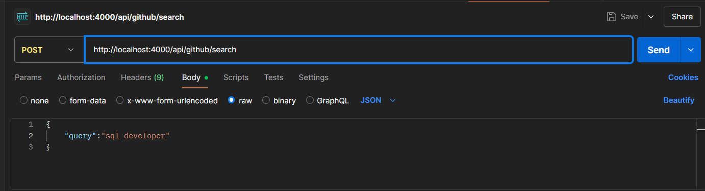

# Athena – Backend Intern Assignment

This project is a backend service developed using **Node.js (Express)** that scrapes GitHub user profiles and summarizes developer insights using **Gemini Flash 2.5 (Google AI)**. It utilizes **Cheerio** for scraping and **MongoDB** for storing both raw and enriched data.

---

## ✨ Features

*  Scrape GitHub user profiles based on search keywords (e.g., `java developer`)
* Extract profile data: Username, Display Name, Bio, Location, Profile URL
* Retrieve additional context from individual profile pages (e.g., pinned repositories, contributions)
* AI integration to infer:

  * Primary Skills
  * Tech Stack
  * Notable Contributions
*  Expose RESTful API endpoint to trigger the scraping and summarization
*  MongoDB-based storage for all data
*  Live Deployment supported for public access via POST requests

---

## 🌍 Live Deployment

You can test this service by sending a POST request to the deployed endpoint.

### Example Endpoint:

[live Link](https://athena-j7fj.onrender.com)

### Request Body (JSON):

```json
{
  "query": "react developer",
}
```

### Example `Postman` Request:



### Sample Response:

```json
{
    "message": "Scraped users saved successfully",
    "users": [
        {
            "username": "/DeveloperMaia",
            "name": "Gabriel Maia Medeiros",
            "link": "https://github.com//DeveloperMaia",
            "summary": {
                "primary_skills": [
                    "SQL",
                    "DBA",
                    "Java",
                    "PHP",
                    "Technical Support"
                ],
                "tech_stack": [
                    "SQL",
                    "Java",
                    "PHP"
                ],
                "notable_contributions": [
                    "Focus on DBA development",
                    "Java exercises"
                ],
                "_id": "682b7b41702031b7ea8480e3"
            },
            "bio": "SQL - DBA",
            "location": "Itatiaia, Rio de Janeiro, Brasil",
            "contributionCount": "",
            "repos": [
                {
                    "name": "DeveloperMaia",
                    "desc": "",
                    "language": "",
                    "_id": "682b7b41702031b7ea8480dd"
                },
                {
                    "name": "PHP-Rascunhos",
                    "desc": "",
                    "language": "PHP",
                    "_id": "682b7b41702031b7ea8480de"
                }
            ],
            
            "readme": "Olá, bem-vindo ao meu perfil, eu sou o Gabriel Maia! 👋\n\n🔭 Atualmente trabalho como técnico de TI.\n🌱 Estou me desenvolvendo na área de DBA.\n📫 Contate-me no email: gabrielmaia20032000@gmail.com",
            "_id": "682b7b41702031b7ea8480dc"
        }
    ]
}
```

---

## Tech Stack
* **Language:** TypeScript
* **Backend:** Node.js with Express.js
* **Scraping:** Cheerio & Axios
* **AI Integration:** Gemini Flash 2.5 (Google Generative AI API)
* **Database:** MongoDB (via Mongoose)

---

## ⚙️ Setup Instructions (Local)

### 1. Clone the Repository

```bash
git clone https://github.com/Vansh-Garg118/athena
cd athena
```

### 2. Create `.env` File

```env
PORT=4000
DATABASE_URL=your_mongodb_url
GEMINI_API_KEY=your_google_gemini_api_key
```

### 3. Install Dependencies

```bash
npm install
```

### 4. Start the Server

```bash
npm run dev
```

Server runs at: `http://localhost:4000`

---

## 💡 API Endpoint

### `POST /api/github/search`

Trigger the GitHub scraping and enrichment process.

#### Request Body:

* `query` (string): The keyword(s) to search developers by (e.g., `java developer`)


---


## 📄 Assumptions Made

* Scraping is done without GitHub API due to rate limiting for unauthenticated users.
* LLM prompts are optimized for concise skill extraction.
* Default page scrape is 2 pages (\~20 developers).

---


